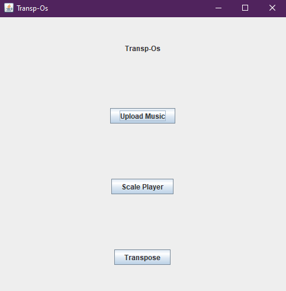
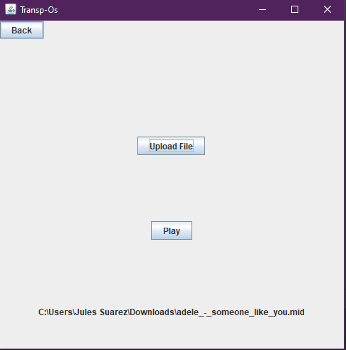
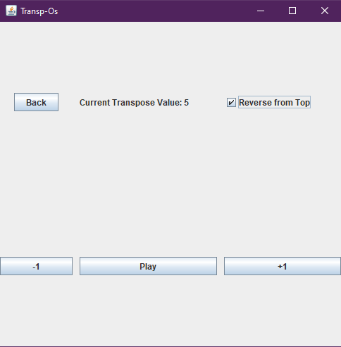
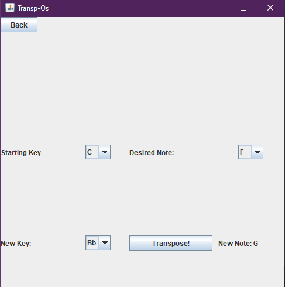

# Transp-Os

**Authors**: Jules Suarez and Nikitha Nagumalli

# Home Screen: 

# Upload/Play Midi File Screen:

# Transpose Scales Screen:

# Transpose Note Screen:

### Libraries:
  - JFugue: https://github.com/dmkoelle/jfugue
### Applications:
  - Transp-Os has three uses:
    - Transposing and playing musical scales:
      - Program allows users to transpose the C scale up or down an indicated half step value
      - The option is given to have the scale played in reverse after hitting the top
    - Uploading and playing a midi file:
      - Program allows users to upload a file from their device, and if it is a .mid file, pressing play will play the entire file
    - Tranposing notes between instrument keys:
      - Using the Circle of Fifths, the program allows users to transpose a note between two instrument keys
      - For example, if a user wants to transpose the note "F" on a Flute (Key of C) to a note on the Clarinet (Key of Bb), the program would return "G"
